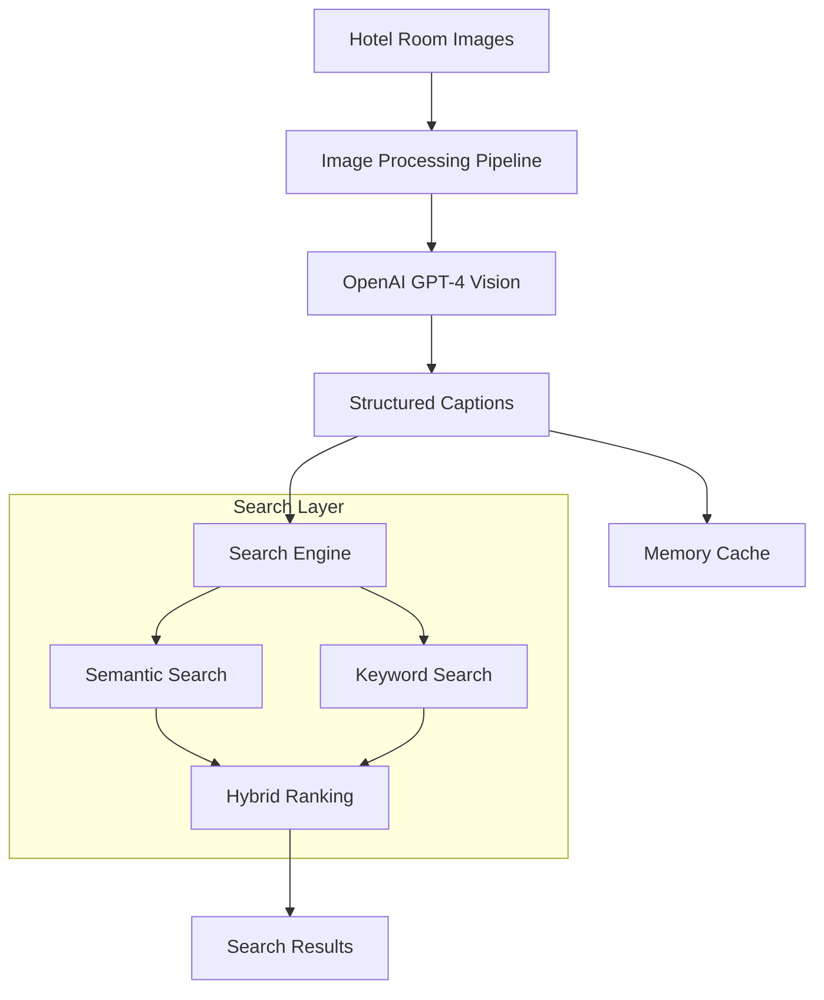

# Hotel Room Image Search System

This system provides an advanced search functionality for hotel room images based on visual preferences and specific criteria. It combines multiple AI and search techniques to deliver accurate results.

## Features

- Image-to-Text conversion using OpenAI's GPT-4 Vision
- Semantic search using Sentence Transformers
- Keyword-based filtering
- Hybrid ranking system combining semantic and keyword matches
- In-memory caching for improved performance
- Support for multiple search criteria:
  - Room type (double, triple, etc.)
  - View type (sea, city, etc.)
  - Amenities (balcony, air conditioning, etc.)
  - Guest capacity
  - Furniture and facilities

## System Architecture



## System Components

1. **Image Processing Pipeline**

   - Downloads hotel room images
   - Processes images using OpenAI's GPT-4 Vision
   - Generates structured captions with room details

2. **Search Engine**

   - Semantic search using Sentence Transformers
   - Keyword-based filtering
   - Hybrid ranking system

3. **Caching System**
   - Simple in-memory caching
   - Caches image captions and search results
   - Improves response time for repeated queries
   - Reduces unnecesarry API calls

## Usage

1. Set up your OpenAI API key in `.env`:

   ```
   OPENAI_API_KEY=your_api_key_here
   ```

2. Install dependencies:

   ```bash
   pip install -r requirements.txt
   ```

3. Process images:

   ```python
   from image_processor import ImageProcessor

   processor = ImageProcessor()
   processor.process_image_folder("path/to/images", "captions.csv")
   ```

4. Search for rooms:

   ```python
   from search_engine import HotelRoomSearchEngine

   search_engine = HotelRoomSearchEngine()
   search_engine.load_data("captions.csv")

   # Semantic search
   results = search_engine.search("double room with sea view")

   # Keyword search
   results = search_engine.search_by_keywords(["sea view", "double bed"])
   ```

## Project Structure

- `image_processor.py`: Image processing and captioning
- `search_engine.py`: Search functionality
- `cache_manager.py`: Simple caching
- `requirements.txt`: Project dependencies
- `.env`: Environment variables
